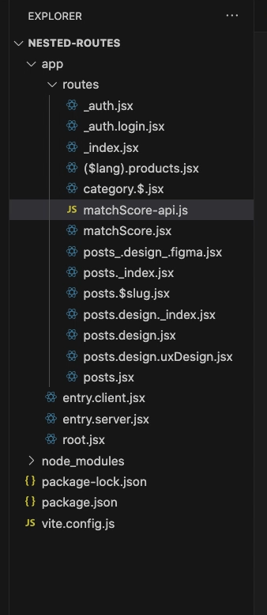

## Rotas Aninhadas

As **rotas aninhadas** permitem que você crie uma estrutura de rotas hierárquica. Isso é útil para renderizar componentes que dependem do contexto de rotas pai.

### Como Funcionam

- **Rotas Pai**: Definem o layout ou contexto compartilhado.
- **Rotas Filhas**: Herdam e podem estender o contexto das rotas pai.


## Compartilhamento de Layout

O **compartilhamento de layout** facilita a reutilização de componentes de layout entre diferentes rotas.

### Benefícios

- **Reutilização de Código**: Evita duplicação.
- **Consistência Visual**: Mantém o mesmo layout em diferentes páginas.
- **Manutenção Simplificada**: Alterações no layout são refletidas em todas as rotas que o utilizam.

### Implementação

Utilize o componente `<Outlet />` para renderizar as rotas filhas dentro do layout pai.

Exemplo:

```tsx
// app/routes/dashboard.tsx
export default function DashboardLayout() {
  return (
    <div>
      <Sidebar />
      <main>
        <Outlet />
      </main>
    </div>
  );
}
```


## Rotas Sem Caminho (Pathless Routes)

As **rotas sem caminho** ou **pathless routes** são rotas que não possuem um segmento de URL próprio, mas servem para agrupar rotas e compartilhar lógica ou layouts.

### Quando Usar

- **Agrupamento Lógico**: Quando rotas compartilham o mesmo layout ou lógica.
- **Organização**: Para manter a estrutura de arquivos limpa.

### Como Implementar

Nomeie a pasta da rota com parênteses.

app 
└── routes 
    └── (auth) 
        ├── login.tsx 
        └── register.tsx


- As rotas `login` e `register` compartilharão o mesmo layout definido em `(auth)`.

Exemplo:

```tsx
// app/routes/(auth).tsx
export default function AuthLayout() {
  return (
    <div>
      <Header />
      <Outlet />
      <Footer />
    </div>
  );
}
```

### Utilizando Rotas Sem Caminho para Autenticação
 
app
└── routes
    ├── (admin)
    │   ├── dashboard.tsx
    │   └── settings.tsx
    └── login.tsx

- Rotas dentro de (admin) exigem autenticação.
- login.tsx é acessível publicamente.


## Rotas com Segmentos Dinâmicos (Dynamic Segment Routes)

No Remix, você pode definir rotas com segmentos dinâmicos usando parâmetros na URL. 
Esses parâmetros permitem capturar parte da URL como uma variável para uso dentro de componentes.

### Como Funcionam

Um segmento dinâmico é definido com o prefixo `$` no nome do arquivo da rota. 
Quando a URL correspondente é acessada, o valor desse segmento dinâmico é passado como uma propriedade (`params`) para o componente da rota.

 

## Rotas com Segmentos Opcionais (Optional Segment Routes)
Além de segmentos dinâmicos, o Remix também suporta segmentos opcionais nas rotas. Isso significa que uma parte da URL pode ser opcional, e o componente será renderizado independentemente de o segmento estar presente ou não.

### Como Funcionam
Os segmentos opcionais são definidos ao envolver o nome do segmento com parênteses no nome do arquivo.

 
 